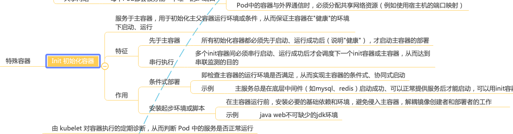

# k-kubernetes-public

面向 docker/kubernates 初学者的快速本地部署和测试 docker/k8s 各种功能特性。 [Kubernates 实战专栏](https://juejin.cn/column/7021047815069499423)

### 运行环境

- MacOs Big Sur 11.4+
- Docker v20.10.7+
- Kubernetes v1.21.2+

### 开箱即用

集成 k8s 部署和测试 常用的基础套件，无需各博客搜索、自建，减少弯路。

目前集成的有

- kubernates dashboard - 官方Dashboard
- Rancher UI - 强大的 k8s/非k8s 集群部署工具
- helm - 基于包的k8s应用部署工具
- Nginx Ingress Controller - 支持 Ingress L7 负载均衡
- metrics-server - k8s 指标聚合器
- kube-prometheus-stack - 一站式的 k8s 集群监控系统

### 无障碍运行

所有配置和脚本均精心设计，利于测试和体验 k8s 的指定特性，且均反复验证，可在 Mac OS 下无障碍运行。

### 完整脑图

从入门到进阶的脑图+实践，建立 k8s 基础知识网络。

- 解构图

- 脑图

[脑图完整版链接](https://mm.edrawsoft.cn/store?workId=172030)

### 使用方法

#### 学习 Init 容器

#### 测试example

