# kube-prometheus-stack 一站式 k8s 集群监控系统

基于 Operator 以及各 CRD 实现 k8s 集群上动态部署和管理 Prometheus 集群、告警规则等，降低手动部署的复杂度。

## 架构

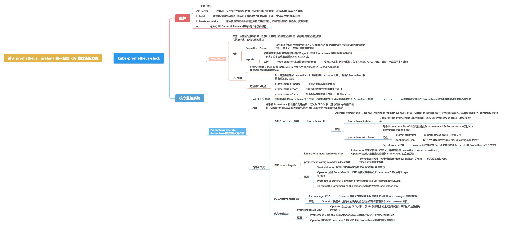
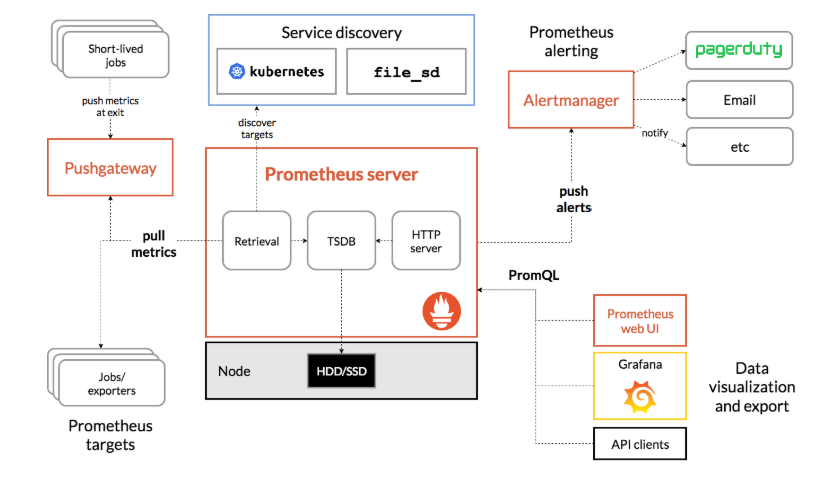
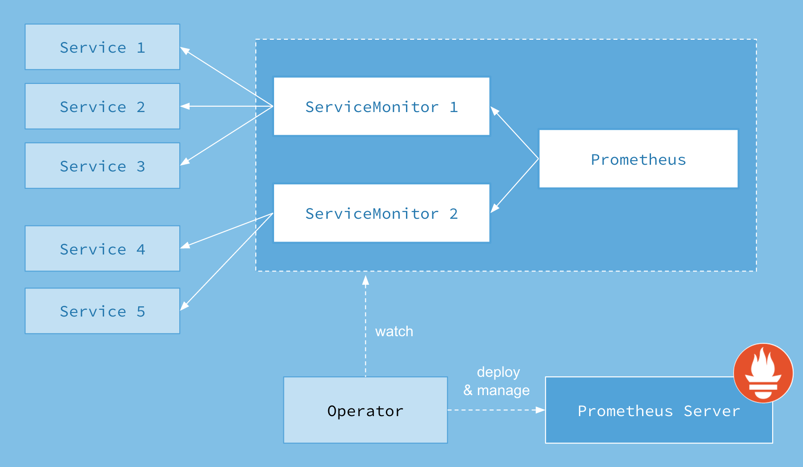


## 部署

### 一键安装

运行以下脚本即可在本地的 k8s 测试集群上安装一整套 Prometheus Operator 监控栈

```
./install.sh
```

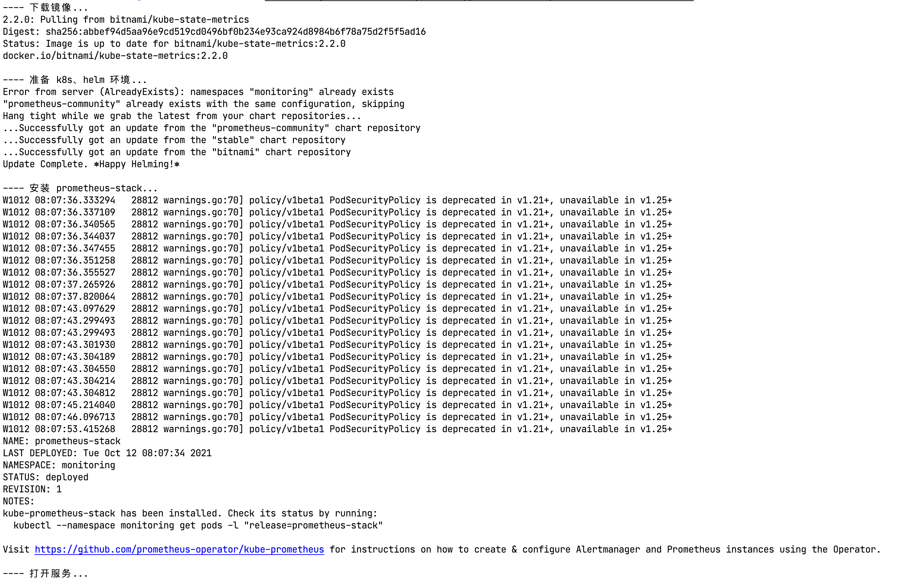

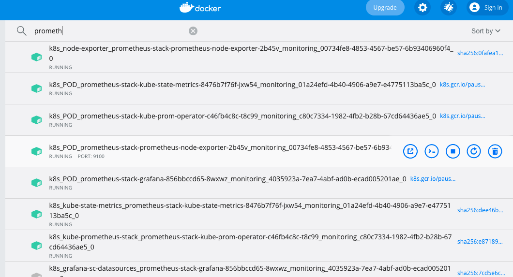

### 检查服务

#### Prometheus Server

时序数据库以及监控服务 [http://localhost:30090](http://localhost:30090)

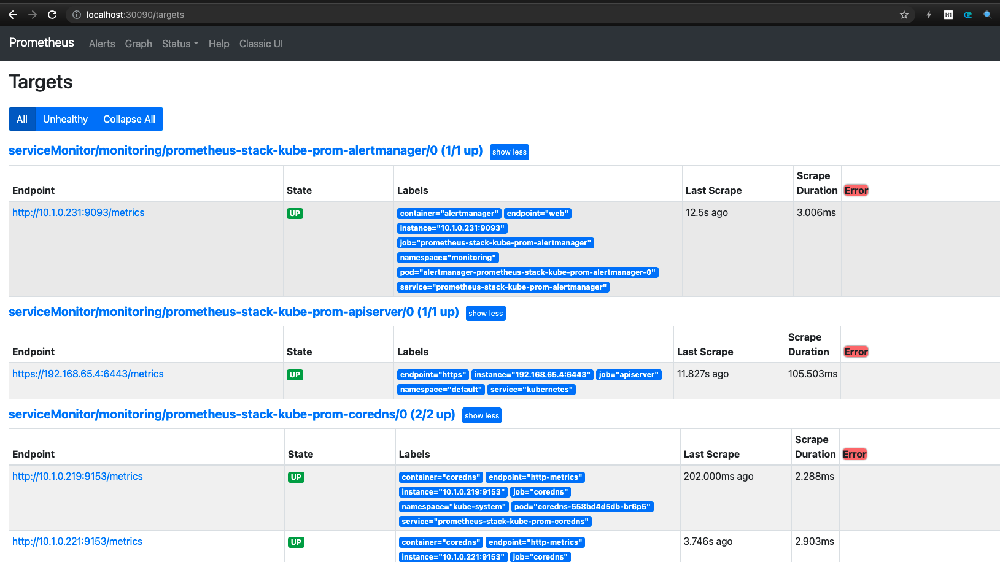

#### Alertmanager

告警规则管理 [http://localhost:30903](http://localhost:30903)

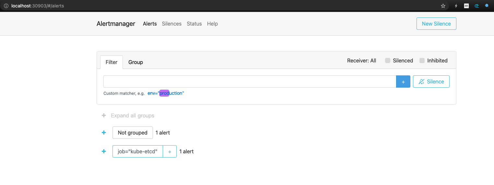

#### kube-state-metrics

指标资源化、对象化服务，以支持高阶的自定义监控 [http://localhost:30100](http://localhost:30100)

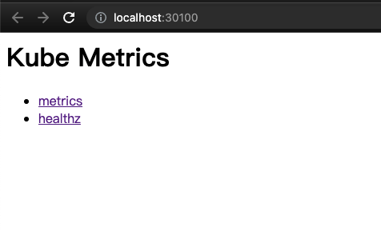
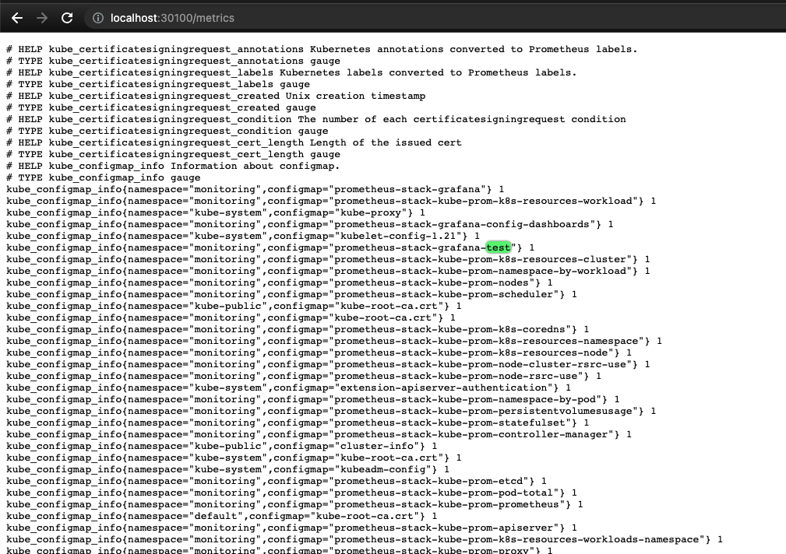

#### node-exporter
 
主机常规性能指标采集和输出 [http://localhost:30101](http://localhost:30101)

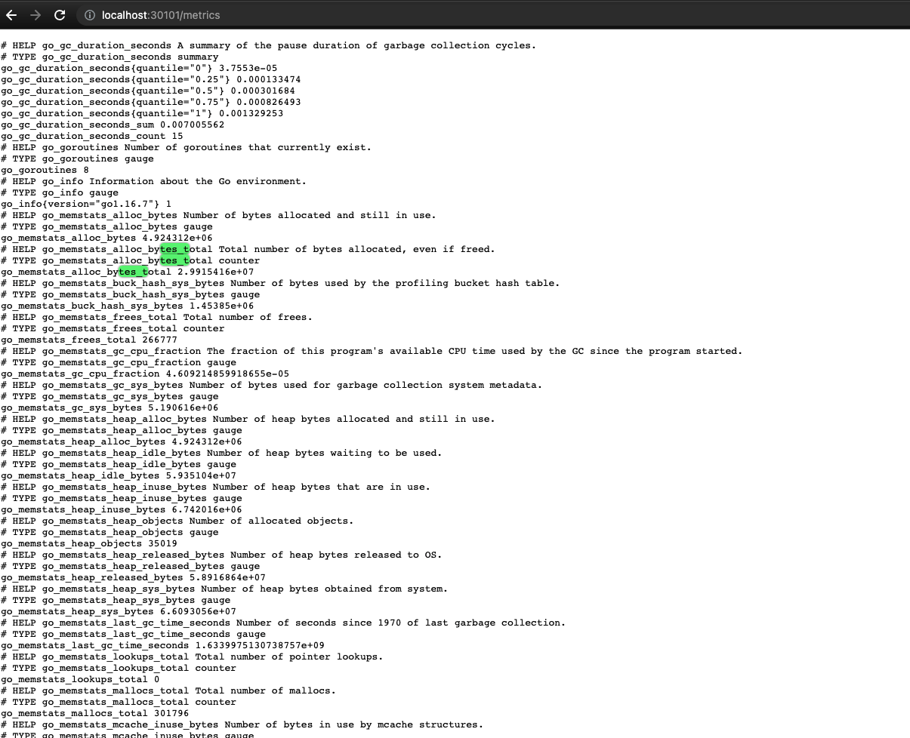

#### Grafana
 
监控指标可视化展示工具 [http://localhost:30001](http://localhost:30001)

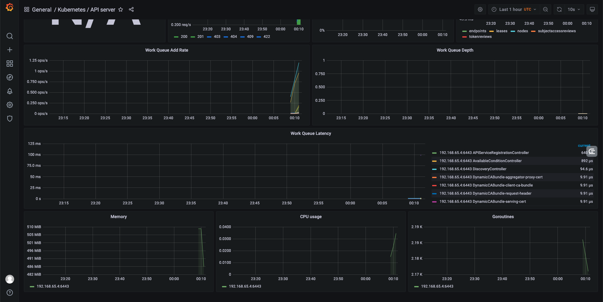

## 一键卸载

运行卸载脚本 `./uninstall.sh`

