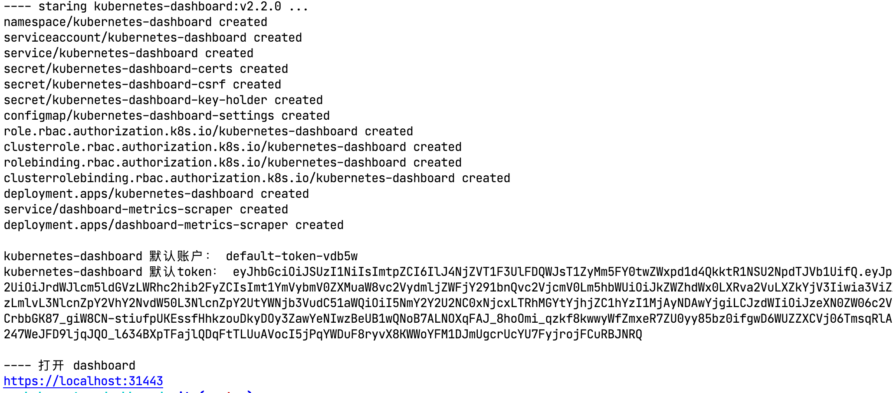
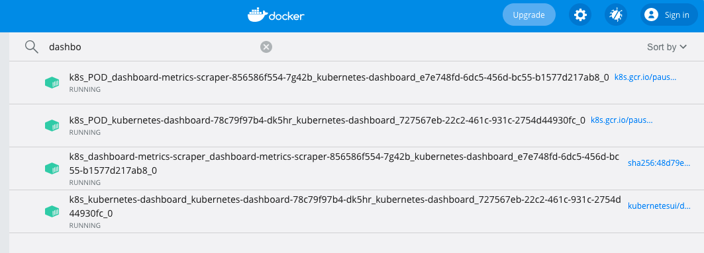
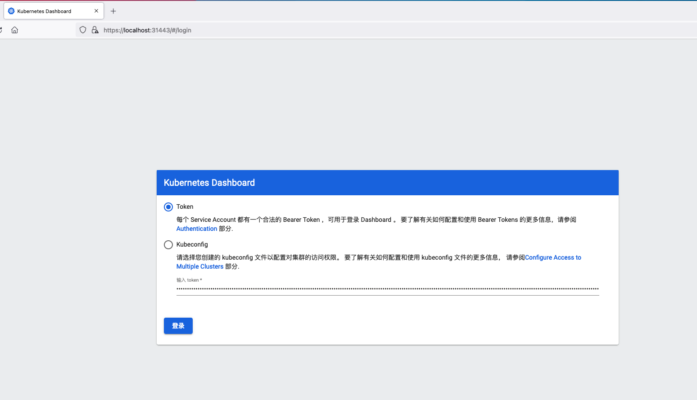
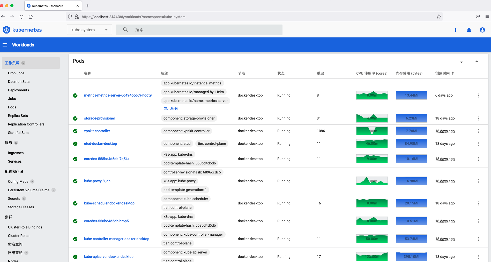
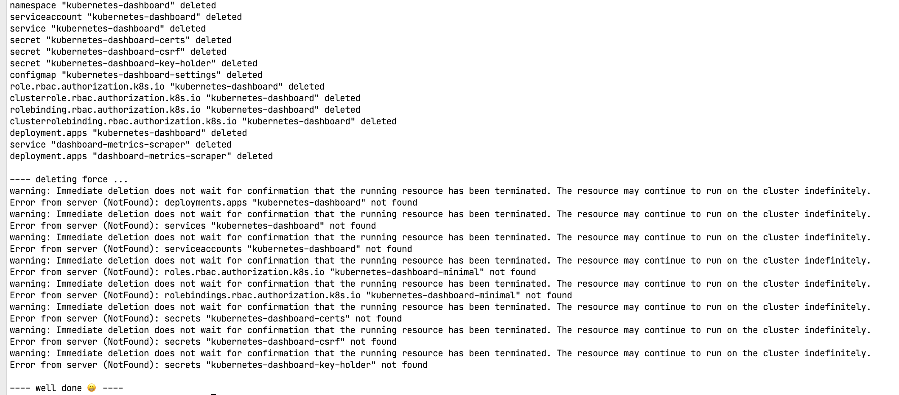

# kubernates dashboard starter

官方提供的 dashboard ，用于部署、管理和测试小规模简单集群

## 部署步骤

### 一键启动

运行安装脚本 `./start.sh` ，即可部署 dashboard 的所有资源，接入 k8s 集群，并自动打印默认的登录 tokeb

### 登录

打开 [dashboard](https://localhost:31443) ，并输入启动时打印的默认 token

## 一键卸载

运行卸载脚本 `./unstall.sh` ，即可彻底卸载 dashboard 的所有资源，不污染本地测试环境。

