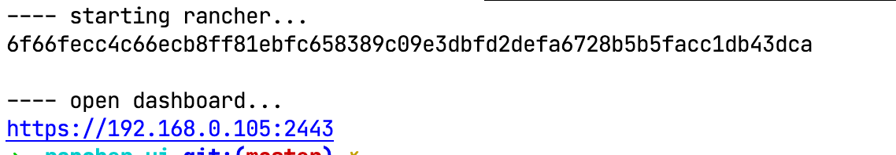
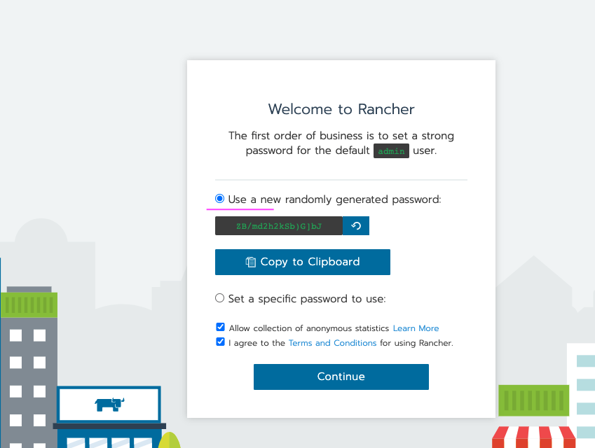
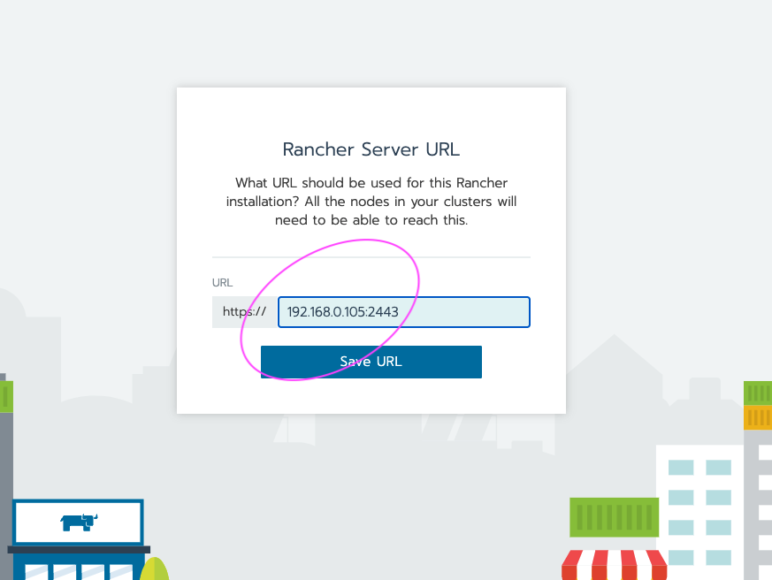
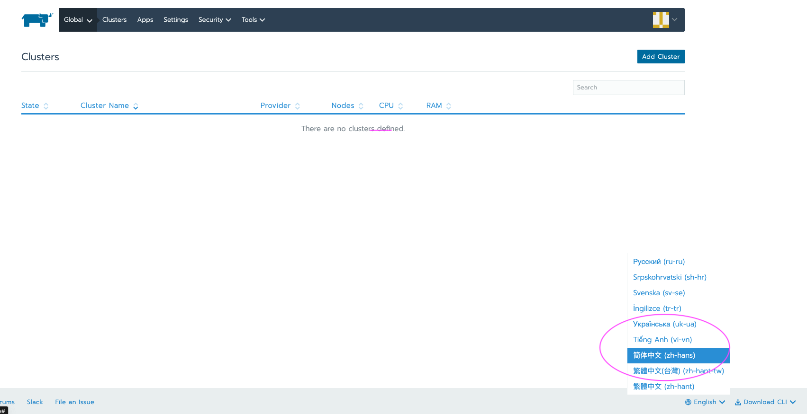
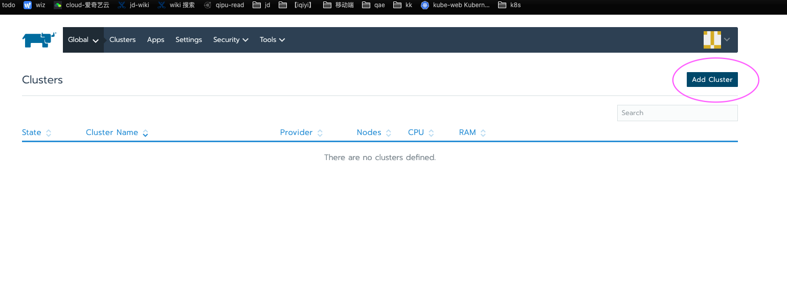
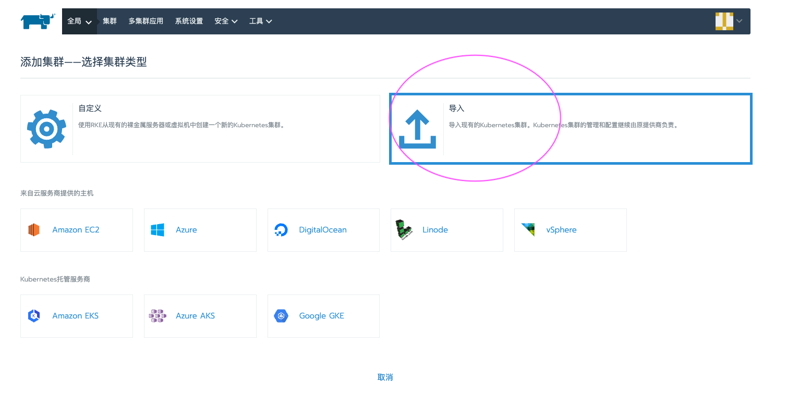
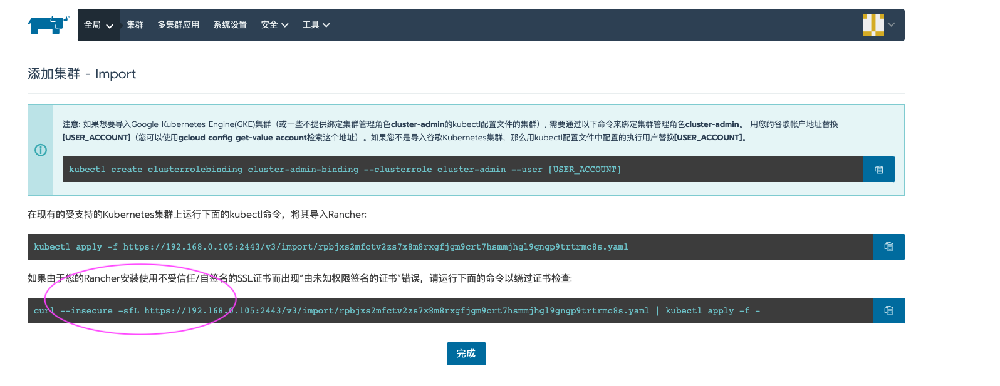
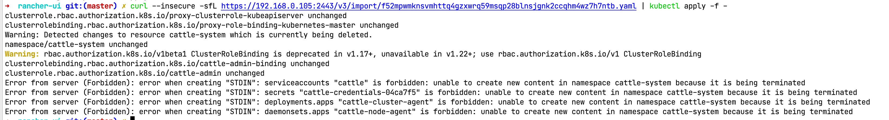
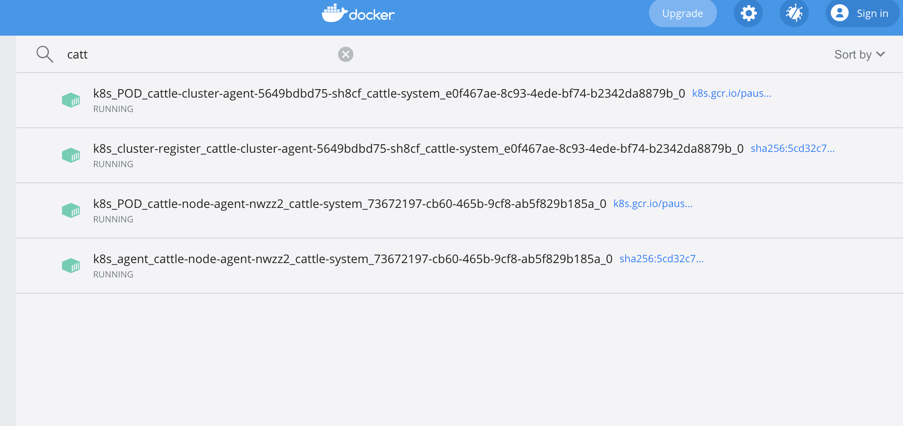
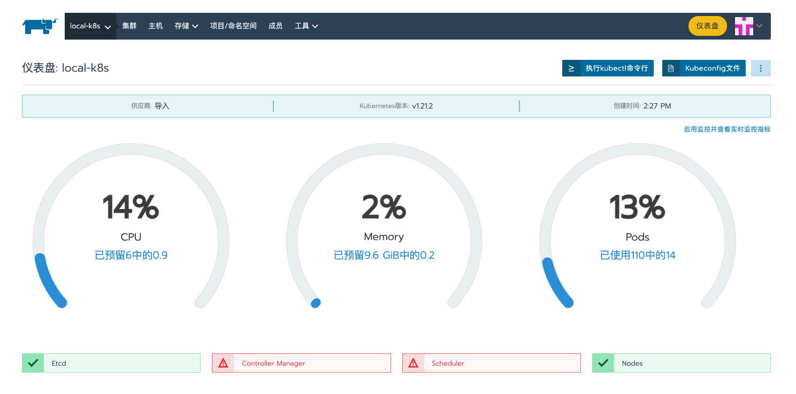

# Rancher UI

专业的集群运维 Dashboard，支持 k8s 以及非 k8s 集群治理框架


## 本地部署

### 启动 rancher 容器

```
./install.sh
```



### 初始化 dashboard 

打开 [dashboard](https://localhost:2443)

#### 设置密码

保存好密码，用于下次登录



#### 设置 Server 地址

必须使用内网ip，如 `https://192.168.0.105:2443 ` ，外网ip可能无法访问端口，localhost导入本地集群、启动 agent 时会报错



#### 设置语言



### 导入本地集群







执行脚本，在 k8s 集群上部署 rancher 代理








